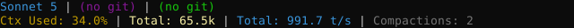
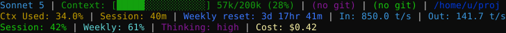
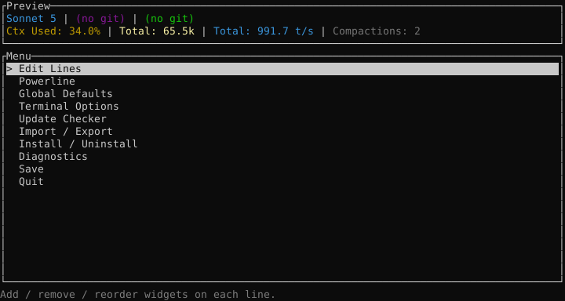
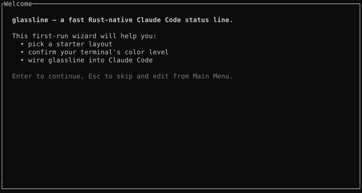
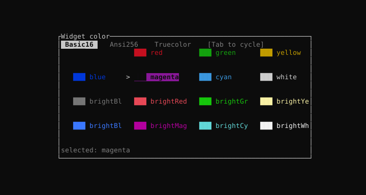

# glassline

<p align="center">
  
  <br/>
  <em>Rendered by the actual pipeline. Two-line Dev-template output.</em>
</p>

## Overview

Rust port of [ccstatusline](https://github.com/sirmalloc/ccstatusline) — a customizable status line formatter for the Claude Code CLI. Reads Claude Code's `StatusJSON` payload on stdin and writes an ANSI status line to stdout: current model, context-window usage, git and jujutsu state, session/weekly usage percentages, token throughput, PR/CI status, and more — driven by a JSON config that matches the upstream schema.

<p align="center">
  
  <br/>
  <em>Power-user template with powerline separators + auto-align.</em>
</p>

**Widget catalog:** 90 canonical widgets + 6 upstream aliases resolve in the built-in registry — full parity with the upstream ccstatusline catalog covering context, tokens, git, jj, session, usage, cache, timing, custom-text, and system widgets (sandbox / voice / remote-control / claude-account-email / vim-mode / cache-timer all ported).

**Interactive editor:** `glassline` typed in a bare terminal opens `glassline-tui` — a keyboard-driven layout editor with live-preview rendering through the real pipeline, first-run wizard (template pick → color level → install), and diagnostics. Piped stdin (Claude Code) renders normally.

**Multi-CLI support (v0.7.0):** one binary, three coding CLIs. Adapter dispatch chooses the right integration by env-var or `--for <slug>` argument:

| CLI | Install target | Data source |
|---|---|---|
| **Claude Code** | `~/.claude/settings.json` `statusLine` hook | stdin `StatusJSON` (piped from Claude Code) |
| **Codex** | `~/.codex/plugins/glassline/{plugin.json, hooks.json}` | `$CODEX_HOME/sessions/*.jsonl` rollout, tolerant JSONL parser. Also accepts stdin per [openai/codex#16921](https://github.com/openai/codex/issues/16921) when Codex ships it. |
| **Grok** | `~/.grok/plugins/glassline/plugin.json` + `grok plugin enable glassline` | `~/.grok/signals.json` (mandatory) + `updates.jsonl` (optional, for active tool) |

Widget catalog is shared. Widgets that key on Anthropic-specific concepts (`block-timer`, `session-usage`, `weekly-*`) render as `(unavailable)` when dispatched through the Codex or Grok adapter — the wizard's install summary lists the caveats up-front.

**Hardening:** cross-process lock file, macOS Keychain fallback for OAuth token, `HTTPS_PROXY` / `NO_PROXY` resolution, per-outcome cache TTL, `Retry-After` honoring on 429.

## Attribution

This project is a Rust port of [ccstatusline](https://github.com/sirmalloc/ccstatusline) by **Matthew Breedlove** (© 2025), distributed under the MIT License. Structure, widget behavior, response-parsing semantics, and the OAuth usage-endpoint contract are modeled on that upstream. A verbatim copy of the upstream copyright notice is included as [`LICENSE-UPSTREAM`](./LICENSE-UPSTREAM), as MIT requires.

The port itself — Rust module layout, all code in `crates/`, the cross-process lock design, and the CI/tooling — is original work © 2026 Kurt Milan, also under MIT (see [`LICENSE`](./LICENSE)).

If you fork or reuse this port, please preserve BOTH copyright notices and this attribution paragraph. Stripping them is a license violation.

## Installation

Pick whichever channel fits. Every option installs the same binary — after any of them, run `glassline install` to wire it into `~/.claude/settings.json`.

### Universal one-liner (macOS / Linux)

```bash
curl -fsSL https://raw.githubusercontent.com/kurtbot/glassline/main/packaging/install.sh | sh
```

Downloads the archive matching your OS+arch from the latest release, verifies its SHA256, extracts to `~/.local/bin/glassline`.

Pin a version: `sh -s -- --version v0.6.2`. Override dir: `sh -s -- --dir /usr/local/bin`. Skip PATH modification: `sh -s -- --no-path`.

By default the installer appends `$INSTALL_DIR` to your shell rc (`.bashrc` / `.zshrc` / `~/.config/fish/config.fish`) via a marked, idempotent block so `glassline` is on `PATH` after a shell restart. `--no-path` prints the export line instead of writing it.

### Windows (PowerShell)

```powershell
iwr https://raw.githubusercontent.com/kurtbot/glassline/main/packaging/install.ps1 -UseBasicParsing | iex
```

Installs to `%LOCALAPPDATA%\glassline\`. Same SHA256 verification. By default the installer also appends the install dir to your **User** `Path` env var via `[Environment]::SetEnvironmentVariable(...)` — idempotent, no admin required, takes effect after opening a new terminal. Pass `-NoPath` to opt out.

### Homebrew (macOS + Linuxbrew)

```bash
brew tap kurtbot/glassline https://github.com/kurtbot/glassline.git
brew install glassline
```

### cargo-binstall (Rust ecosystem)

Fetches the prebuilt binary instead of source-compiling:

```bash
cargo binstall --git https://github.com/kurtbot/glassline glassline-render
```

(The `--git` flag is required because the crates are workspace-only — not published to crates.io.)

### From source

Requires Rust 1.96.0 (pinned in `rust-toolchain.toml`).

```bash
cargo install --path crates/glassline-render
```

### After install

```bash
glassline install     # writes ~/.claude/settings.json statusLine hook
glassline --version   # confirm
glassline uninstall   # revert
```

Prebuilt raw archives + `SHA256SUMS.txt` are on the [Releases](https://github.com/kurtbot/glassline/releases) page if you'd rather download manually.

## Configure the layout

Type `glassline` in any terminal (with no piped input) — the render binary detects the TTY and forwards to the editor.

<p align="center">
  
  <br/>
  <em>Main menu — live preview strip on top, ten menu entries, category-tinted rows.</em>
</p>

**First run** opens a wizard: welcome → template pick (Minimal / Dev / Power user, with live preview of each) → color-level confirm (auto-detected from `$COLORTERM` / `$TERM` / `$WT_SESSION`) → optional `glassline install --user` right then and there. Any step accepts `Esc` to skip.

<p align="center">
  
  <br/>
  <em>First-run wizard (welcome step).</em>
</p>

**Later runs** land on the main menu:

| Menu entry | What it opens |
|---|---|
| Edit Lines | Add / remove / reorder widgets. Each widget row is tinted by its category color; each line shows widget count + a preview snippet. |
| Powerline | Enable + separator glyph + theme + auto-align + continue-across-lines. |
| Global Defaults | (Deferred — hand-edit rarely-changed fields in `settings.json` for now.) |
| Terminal Options | Flex mode / compact threshold / git cache TTL / minimalist mode. `←/→` steps values inline, `Enter` opens the full list picker. |
| Update Checker | Enable + interval-hours cadence + daily-at-hour cadence. Schema only until the periodic check ships in the render binary. |
| Import / Export | Auto-detect ccstatusline / import from a specific file / export current scratch. Folder paths get `my-glassline-export.json` appended. |
| Install / Uninstall | Runs `glassline install --user` / `--project` / `uninstall --user` under the hood; shows live wiring status from `~/.claude/settings.json`. |
| Diagnostics | Config path, WIDGETS↔META parity, `$COLORTERM`/`$TERM`, Claude Code wiring status, tail of `~/.cache/glassline/debug.log`. |
| Save | Atomic tmp+rename to the resolved settings path. |
| Quit | Exit (prompts if there are unsaved changes). |

**Widget editor** (Enter on a widget row): ↑/↓ focuses a knob, Enter opens the appropriate sub-modal (Color menu — Basic16 / Ansi256 / Truecolor, with `Tab` cycling modes; Text input; Choice list; Integer input with min/max validation), Space toggles Bool knobs inline, Esc reverts screen-local edits, Ctrl-S keeps them. A live preview strip at the top of every screen shows what the hot path would render with the current scratch settings — colors survive through `ansi-to-tui`.

<p align="center">
  
  <br/>
  <em>Basic16 color picker — Tab cycles Basic16 / Ansi256 / Truecolor.</em>
</p>

The gallery lives under [`docs/screenshots/`](./docs/screenshots) — regenerate with `glassline-tui --emit-screenshots docs/screenshots`.

**Non-interactive flags** for scripted workflows:

```bash
glassline-tui --dry-run                      # validate config parses cleanly, exit 0/1
glassline-tui --config <path>                # override the config location
glassline-tui --import <path>                # migrate a ccstatusline / glassline file to the config path
glassline-tui --export <path>                # dump scratch to a path
```

## Migrating from ccstatusline

If you already have a working `ccstatusline` config, `glassline import` picks it up and migrates it in one shot — no hand-copy, no schema archaeology.

```bash
glassline import                          # auto-detect + prompt
glassline import --dry-run                # preview only, no writes
glassline import --from /path/settings.json --to /path/glassline.json --yes
```

The importer probes six paths for a ccstatusline source (`$CCSTATUSLINE_CONFIG`, XDG, `~/.config/ccstatusline`, legacy `~/.claude/ccstatusline`, `%APPDATA%`, `%LOCALAPPDATA%`) and writes to glassline's own config path atomically under a `settings.lock`. The original ccstatusline file is never modified — deleting the freshly-written glassline `settings.json` reverts you.

Exit codes: `0` ok · `1` no source · `2` parse/migrate error · `3` target exists without `--force` · `4` write error.

## Animation

Effects like coloured thresholds and pulses are opt-in per widget via `settings.json` metadata. Nothing animates by default.

Per-widget metadata keys (`WidgetSpec.metadata`, values are strings):

| Key             | Value                              | Effect                                                |
|-----------------|------------------------------------|-------------------------------------------------------|
| `animate`       | `rainbow`, `pulse`, `sweep`        | Unconditional time-based colour cycle                 |
| `cycleSeconds`  | `"30"`                             | Cycle length (default 60)                             |
| `thresholds`    | `"50:green,80:yellow,100:red"`     | Colour picker keyed on rendered percent (ascending)   |
| `pulseAbove`    | `"80"`, `"80%"`, `"0.8"`           | Pulse only when rendered percent ≥ N — composes with `thresholds` |
| `gradientStart` | `"#rrggbb"`                        | Start colour for a static or sweep gradient           |
| `gradientEnd`   | `"#rrggbb"`                        | End colour for a static or sweep gradient             |

Thresholds and `pulseAbove` need a percent to work against. Widgets that render a percent directly (`context-percentage`, `session-usage`, `weekly-*`) read it from their own text. Token/cache widgets (`context-length`, `tokens-*`, `cache-*`) attach a hidden percent hint of context-window occupancy, so the same effects fire on them without changing the visible text.

**Two examples.** Pulse the context-length widget when it crosses 85% of the window:

```json
{
  "type": "context-length",
  "color": "blue",
  "metadata": { "pulseAbove": "85" }
}
```

Compose with a colour ramp — cyan under 60%, yellow to 80%, bright red to 90%, flashing red past 90%:

```json
{
  "type": "context-percentage",
  "metadata": {
    "thresholds": "60:cyan,80:yellow,90:brightRed,100:#ff0000|#8b0000",
    "pulseAbove": "85"
  }
}
```

The `|`-separated form under `thresholds` alternates one colour per second — a flashing warning band.

### Animation cadence limitation

Claude Code samples the status line on user/tool events and on its configured `refreshInterval` when idle. Every animation effect (`pulse`, `rainbow`, `sweep`, flashing `thresholds`, `pulseAbove`) advances one frame per sample — visibly smooth during active work, frozen when idle.

To see smoother animation while idle, lower `refreshInterval` (in `~/.claude/settings.json`, inside the `statusLine` object). The value is in **seconds**, minimum `1` (see [Claude Code docs](https://code.claude.com/docs/en/statusline)). `glassline install` prints a hint when it detects a value ≥ 5 seconds.
